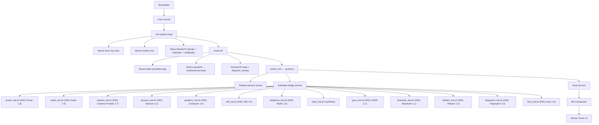

# System Architecture — Ubuntu Touch HIDL GSI on Android Treble Devices

## Boot Sequence



## Layer Architecture

| Layer | Component | Purpose |
|-------|-----------|---------|
| **L0** | Bootloader (OEM) | Hardware init, A/B slot, verified boot |
| **L1** | Linux Kernel (vendor) | Hardware drivers, BinderFS, OverlayFS |
| **L2** | Custom init | Mount vendor, BinderFS, pivot to Ubuntu |
| **L3** | systemd | Service management, graphical target |
| **L4** | HwBinder bridge | Orchestrate HIDL HAL wrappers |
| **L5** | HIDL HAL | Power, audio, camera, sensors, graphics, WiFi, radio, GNSS, BT, vibrator, biometrics |
| **L6** | Mir/Wayland | Display compositor |
| **L7** | Lomiri | Ubuntu Touch shell + apps |

## Partition Layout

```
┌─────────────────────────────┐
│ boot    │ Kernel + ramdisk  │
├─────────────────────────────┤
│ system  │ Custom init +     │ ← system.img (fastboot flash)
│         │ mount scripts     │
├─────────────────────────────┤
│ vendor  │ OEM HAL binaries  │ ← Untouched (read-only)
├─────────────────────────────┤
│ userdata│ linux_rootfs.sqfs │ ← userdata.img (fastboot flash)
│         │ uhl_overlay/      │
│         │   upper/          │
│         │   work/           │
│         │   snapshots/      │
└─────────────────────────────┘
```

## HwBinder IPC Architecture

This GSI talks to Android vendor HALs **exclusively via HIDL HwBinder IPC**:

```
Ubuntu Process → /dev/hwbinder → hwservicemanager (vendor) → Vendor HIDL HAL
                                                    │
                                          (or passthrough .so)
                                          /vendor/lib(64)/hw/<pkg>@<ver>-impl.so
```

- **HIDL only** — no AIDL HALs, no `/dev/binder` for HALs.
  Framework binder remains mounted for non-HAL clients (e.g. InputFlinger
  RPC and `servicemanager` debug), but HAL wrappers are forbidden from
  using it.
- **Service discovery** is performed by:
  1. `lshal -ip` (when present in the rootfs)
  2. VINTF manifest fragments under `/vendor/etc/vintf/manifest/*.xml`
  3. Passthrough `.so` probes under `/vendor/lib*/hw/`
- **Optional access** — HAL wrappers degrade to mock mode if neither
  binderized nor passthrough vendor HAL is detected. Critical HALs
  (`power`, `graphics`) refuse to mock-fail.
- **Vendor partition mounted read-only** at `/vendor` by the custom init
  (Stage 2) and bind-mounted into the Ubuntu root via `mount.sh`.

### Why HIDL?

- Devices shipping with Android 8.0–11.0 ship vendor HALs as **HIDL only**.
  Their VINTF manifest declares `format="hidl"` and their HALs live in
  `/vendor/lib*/hw/` (passthrough) or are spawned by `hwservicemanager`
  (binderized).
- Ubuntu Touch on a HIDL-only vendor partition cannot reach hardware via
  AIDL — `servicemanager` over `/dev/binder` won't see HIDL HALs.
- A HIDL-aware bridge therefore bypasses `/dev/binder` for HALs entirely
  and uses `/dev/hwbinder` (or passthrough loads) instead.

## HIDL Interface Versions

| HAL          | HIDL Interface                                                        |
|--------------|------------------------------------------------------------------------|
| Power        | `android.hardware.power@1.3::IPower`                                  |
| Audio        | `android.hardware.audio@7.0::IDevicesFactory`                         |
| Camera       | `android.hardware.camera.provider@2.7::ICameraProvider`               |
| Sensors      | `android.hardware.sensors@2.1::ISensors`                              |
| Graphics     | `android.hardware.graphics.composer@2.4::IComposer`                   |
| WiFi         | `android.hardware.wifi@1.6::IWifi`                                    |
| Telephony    | `android.hardware.radio@1.6::IRadio`                                  |
| GNSS         | `android.hardware.gnss@2.1::IGnss`                                    |
| Bluetooth    | `android.hardware.bluetooth@1.1::IBluetoothHci`                       |
| Vibrator     | `android.hardware.vibrator@1.3::IVibrator`                            |
| Fingerprint  | `android.hardware.biometrics.fingerprint@2.3::IBiometricsFingerprint` |
| Face         | `android.hardware.biometrics.face@1.0::IBiometricsFace`               |
| Input        | `ubuntu.gsi.input@1.0::IInputClassifier` (synthetic — HIDL has no input HAL) |

## Filesystem Layers

```
OverlayFS Merged Root
├── Lower: squashfs (read-only Ubuntu rootfs)
├── Upper: /data/uhl_overlay/upper (persistent changes)
└── Work:  /data/uhl_overlay/work
```

Changes (apt installs, config edits) persist in the upper layer. The squashfs base is immutable. Rollback = delete the upper layer.
