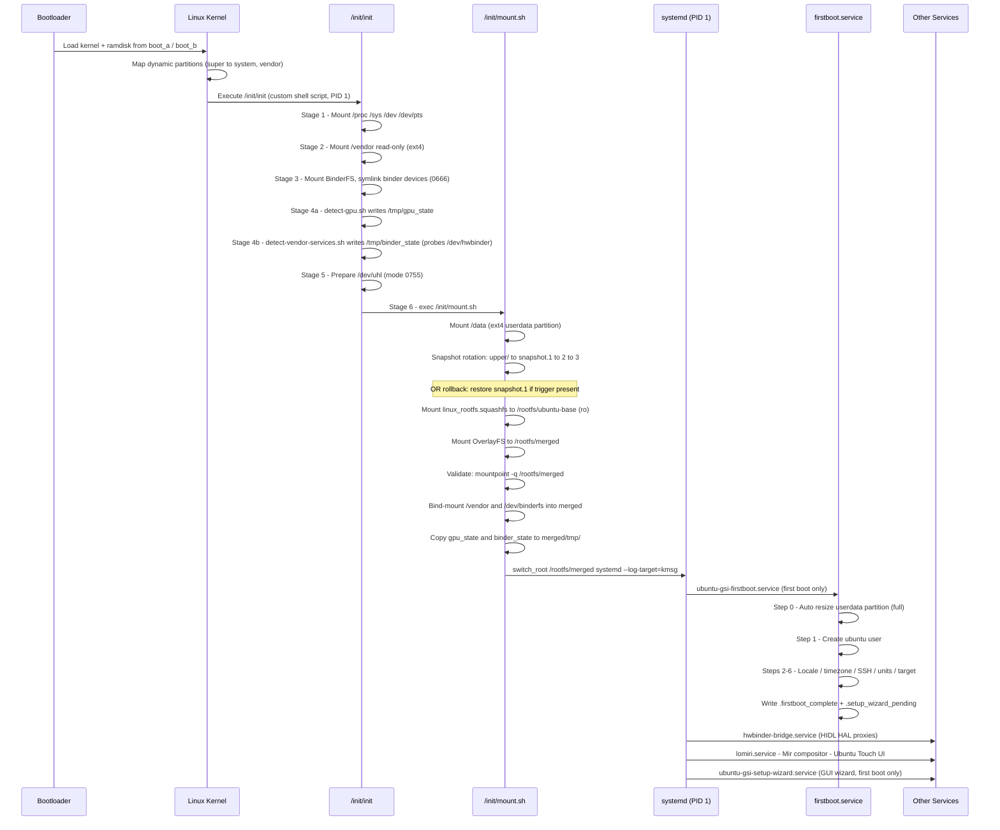

# Boot Flow — Ubuntu Touch HIDL GSI on Treble-Compliant Devices

This document describes the complete boot sequence from power-on to a running Ubuntu userspace.
HALs are reached over **HIDL HwBinder** (`/dev/hwbinder`), not AIDL.

---

## Boot Sequence Diagram

---

## Detailed Phase Descriptions

### Phase 1 — Bootloader (unmodified, vendor-provided)

| Step | Description |
|------|-------------|
| 1.1 | Device powers on; bootloader initializes hardware |
| 1.2 | A/B slot selection — chooses active slot (`_a` or `_b`) |
| 1.3 | Verified boot — validates `vbmeta`, `boot.img`, `system.img` signatures |
| 1.4 | Loads kernel + ramdisk from `boot` partition |
| 1.5 | Passes device tree blob (DTB) from `dtbo` partition |

> The bootloader is entirely vendor-provided and **not modified** by this GSI.

### Phase 2 — Linux Kernel

| Step | Description |
|------|-------------|
| 2.1 | Kernel decompresses and initializes |
| 2.2 | Device tree parsed; hardware initialized |
| 2.3 | Dynamic partitions: `super` partition parsed, logical partitions mapped |
| 2.4 | System partition (GSI) mounted |
| 2.5 | Kernel executes `/init/init` (custom POSIX shell script, PID 1) |

**Required kernel features:** `CONFIG_ANDROID_BINDERFS`, `CONFIG_OVERLAY_FS`, `CONFIG_SQUASHFS`, `CONFIG_EXT4_FS`

### Phase 3 — Custom init (`/init/init`)

The custom init entirely replaces Android init. It is a plain POSIX shell (`/bin/sh`) script.

| Stage | Description |
|-------|-------------|
| **1** | Mount `/proc`, `/sys`, `/dev`, `/dev/pts` |
| **2** | Mount `/vendor` read-only (`ext4`, by-name symlink or `dm-linear`) |
| **3** | Mount BinderFS at `/dev/binderfs`; symlink `binder`, `vndbinder`, `hwbinder`; `chmod 0666` |
| **4** | Run `detect-gpu.sh` (result → `/tmp/gpu_state`) and `detect-vendor-services.sh` (result → `/tmp/binder_state`) |
| **5** | Create `/dev/uhl` (mode 0755) for HAL socket namespace |
| **6** | `exec /init/mount.sh` — hand control to the pivot script |

**What this init does NOT do** (compared to standard Android):
- ❌ Spawn Android `init.rc` services (Zygote, system_server, surfaceflinger)
- ❌ Start any Android runtime
- ❌ Start SurfaceFlinger or any display pipeline

**What this init DOES rely on** (HIDL-specific):
- ✓ `/dev/hwbinder` symlinked from `/dev/binderfs/hwbinder`
- ✓ `/vendor` mounted read-only so vendor `hwservicemanager` and HIDL
  `.so` impls (`/vendor/lib*/hw/<pkg>@<ver>-impl.so`) are reachable
- ✓ VINTF manifest fragments under `/vendor/etc/vintf/manifest/` are visible

### Phase 4 — OverlayFS Pivot (`/init/mount.sh`)

| Step | Description |
|------|-------------|
| 4.1 | Mount `/data` as `ext4` (`/dev/block/bootdevice/by-name/userdata`) |
| 4.2 | **Rollback check**: if `/data/uhl_overlay/rollback` exists → restore `snapshot.1` to `upper/`; delete trigger; log to `rollback.log` |
| 4.3 | **Snapshot rotation**: copy `upper/` → `snapshot.1`; shift `1→2→3`; garbage-collect generation > 3 |
| 4.4 | Mount `linux_rootfs.squashfs` (loop) → `/rootfs/ubuntu-base` |
| 4.5 | Mount OverlayFS: `lower=/rootfs/ubuntu-base`, `upper=/data/uhl_overlay/upper`, `work=/data/uhl_overlay/work` → `/rootfs/merged` |
| 4.6 | Validate: `mountpoint -q /rootfs/merged` — abort on failure |
| 4.7 | Bind-mount `/vendor` → `merged/vendor`; `/dev/binderfs` → `merged/dev/binderfs` |
| 4.8 | Copy `/tmp/gpu_state`, `/tmp/binder_state` → `merged/tmp/` |
| 4.9 | `exec switch_root /rootfs/merged /lib/systemd/systemd --log-target=kmsg` |

### Phase 5 — systemd

systemd becomes the new PID 1 inside the Ubuntu root.

| Step | Description |
|------|-------------|
| 5.1 | systemd reads unit files from `/etc/systemd/system/` |
| 5.2 | Reaches `local-fs.target` |
| 5.3 | **First boot only**: `ubuntu-gsi-firstboot.service` runs (gated by `ConditionPathExists=!/data/uhl_overlay/.firstboot_complete`) |
| 5.4 | `hwbinder-bridge.service` — launches HIDL HAL proxies (reads `/usr/lib/ubuntu-gsi/hidl/manifest.json`) |
| 5.5 | `lomiri.service` — starts Mir compositor and Ubuntu Touch shell |

### Phase 6 — First Boot (`ubuntu-gsi-firstboot.service`)

Runs exactly once. Fully non-interactive; all output goes to the journal.

| Step | Action |
|------|--------|
| **0** | **Automatic partition resize** — `resize2fs` expands userdata to full partition capacity |
| **1** | Create user `ubuntu` (password `ubuntu`), groups `sudo,audio,video,input,render`; configure `NOPASSWD` sudo |
| **2** | Generate `en_US.UTF-8` locale |
| **3** | Set timezone to UTC |
| **4** | Enable NetworkManager and SSH daemon |
| **5** | Mask incompatible units (`systemd-udevd`, `systemd-modules-load`, …) |
| **6** | Set `graphical.target` as default systemd target |
| Done | Write `/data/uhl_overlay/.firstboot_complete` and `/data/uhl_overlay/.setup_wizard_pending` |

### Phase 7 — GUI Setup Wizard (`ubuntu-gsi-setup-wizard.service`)

Runs after Lomiri starts on first boot. Provides a touch-friendly graphical setup using `zenity` dialogs with `onboard` on-screen keyboard.

| Step | Action |
|------|--------|
| **1** | Launch on-screen keyboard (`onboard`) automatically |
| **2** | Username setup — change from default `ubuntu` |
| **3** | Password setup — set new password (with confirmation) |
| **4** | Timezone selection — pick from common timezones |
| **5** | Language selection — choose system locale |
| **6** | Apply settings (usermod, chpasswd, locale-gen, etc.) |
| Done | Write `/data/uhl_overlay/.setup_wizard_complete`; remove `.setup_wizard_pending` |

---

## First Boot vs. Subsequent Boots

| Aspect | First Boot | Subsequent Boots |
|--------|------------|-----------------|
| Partition resize | Automatic (full) | Skipped (marker present) |
| User creation | `ubuntu` / `ubuntu` created | Already exists |
| GUI Setup Wizard | Launches after Lomiri | Skipped (marker present) |
| Boot time (approx.) | ~60 s (includes partition resize + wizard) | ~15–30 s to login |
| `firstboot.service` | Runs to completion | Exits immediately (idempotent) |
| `setup-wizard.service` | Runs after Lomiri | Exits immediately (idempotent) |

---

## Exit Conditions and Error Handling

| Condition | Behavior |
|-----------|----------|
| `linux_rootfs.squashfs` not found | `mount.sh` exits 1 → kernel panic / device reboot |
| OverlayFS mount fails validation | `mount.sh` exits 1 |
| Rollback trigger present | `snapshot.1` restored to `upper/`; trigger deleted |
| `systemd` binary missing | `mount.sh` explicit check exits 1 |
| firstboot already ran | `firstboot.sh` exits 0 immediately (idempotent marker) |
| `resize2fs` fails | Warning logged; firstboot continues to completion |
