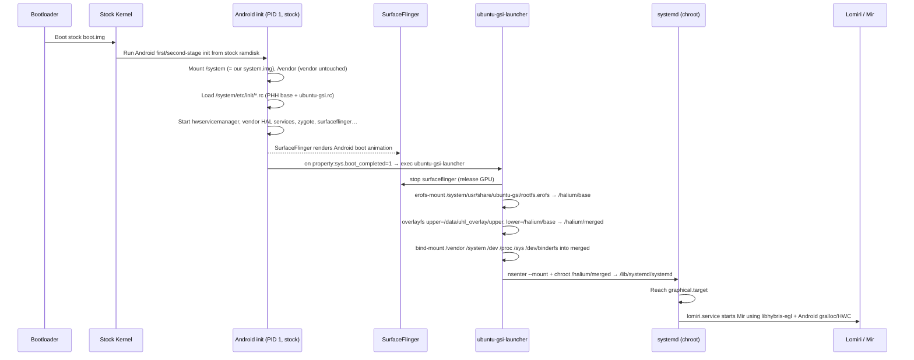

# Halium-Style GSI Architecture (HIDL Variant)

> **Status:** Adopted Apr 2026 (replaces the previous "replace-Android-entirely" design).
>
> This document is the **authoritative design** for the project. All build
> pipelines, scripts, and runtime components must respect this contract.

## 1. Design Constraints (User-Defined)

The following constraints were given by the project owner and **must not be
violated** by any future change:

| # | Constraint | Consequence |
|---|------------|-------------|
| 1 | **`boot.img` must remain the stock Nothing/OEM image** | Custom kernels and custom ramdisks are forbidden. PID 1 is therefore the OEM Android init. |
| 2 | **The kernel must remain the stock OEM kernel** | We have no control over kernel command-line, modules, or sepolicy_compat. We rely on whatever kernel features the OEM shipped. |
| 3 | **Flashing must use only `fastboot flash system` (and at most a disabled `vbmeta`)** | No `boot`, `vendor_boot`, `dtbo` or `vendor` flashing. |
| 4 | **Vendor partition is read-only and untouched** | All vendor HALs run unmodified in their original Android process tree. |

These rules are enforced at build time: `scripts/check_build_invariants.sh`
fails the build if any artefact targets `boot`, `vendor_boot`, `dtbo`, or
`vendor`.

## 2. Why "Halium-Style" and Not "Pure Linux GSI"

A pure Linux replacement would require us to swap the ramdisk inside the boot
partition (so that PID 1 becomes our shell/systemd instead of Android init).
That is impossible under Constraint #1.

The only viable architecture that satisfies all four constraints is the
**Halium-inverse model**, the same model that powers UBports / Halium /
Volla Phone:

* Android boots normally, all the way through `init.rc`, `zygote`, and HAL
  service registration.
* A late-boot `service` declared in `/system/etc/init/ubuntu-gsi.rc` launches
  `/system/bin/ubuntu-gsi-launcher`.
* The launcher mounts a self-contained Ubuntu rootfs (`erofs`) shipped inside
  the system partition, sets up bind-mounts, and `chroot`s `systemd` into it.
* Inside the chroot, `systemd` brings up Lomiri (Mir compositor) using
  **libhybris** so OpenGL ES / EGL / Vulkan calls are forwarded to the vendor
  drivers that Android already loaded.
* HAL access (audio, camera, sensors, telephony, GNSS, vibrator, fingerprint,
  bluetooth, wifi, …) is performed **directly via `/dev/hwbinder`** because
  Android already started `hwservicemanager` and every vendor HAL service.
  No custom bridge process is required.

The previous design's `binder-bridge` / `hwbinder-bridge` daemons and the
self-implemented HAL wrapper shells are therefore **obsolete** and have been
moved to `deprecated/` for historical reference only.

## 3. Boot Flow



## 4. Layout of `system.img`

| Path | Origin | Purpose |
|------|--------|---------|
| `/system/bin/init`, `/system/etc/init/*.rc`, `/system/lib*/`, `/system/apex/`, `/system/framework/` | **PHH Treble GSI v412 (Android 11)** | Provides a fully working Android base because the device's vendor partition is HIDL/Android-11-era. |
| `/system/etc/init/ubuntu-gsi.rc` | **This repo** | Late-boot `service` that launches `ubuntu-gsi-launcher`. |
| `/system/bin/ubuntu-gsi-launcher` | **This repo** | Shell driver that performs the chroot pivot. |
| `/system/bin/ubuntu-gsi-stop-android-ui` | **This repo** | Stops `surfaceflinger`, `bootanim`, `audioserver` cleanly so the Linux compositor can take over. |
| `/system/usr/share/ubuntu-gsi/rootfs.erofs` | **This repo, built from `debootstrap`** | The Ubuntu Focal/Jammy rootfs containing systemd, Mir, Lomiri, libhybris and the apt stack. |
| `/system/usr/lib/ubuntu-gsi/compat/` | **This repo** | The PHH/TrebleDroid-style compatibility engine (`quirks.json`, `compat-engine.sh`, `prop-handler.sh`, `detect-platform.sh`). Now invoked by both Android init (early) and systemd (late). |

The PHH Treble GSI must be either:

1. **Downloaded** by `scripts/fetch_phh_gsi.sh` from the canonical location
   listed in `config.env` (`PHH_GSI_URL`), or
2. **Provided manually** by the operator by dropping the GSI into
   `builder/cache/phh-gsi.img` before running `make build`.

## 5. Layout of the Linux Rootfs (erofs)

```
rootfs.erofs
├── lib/systemd/                         # systemd 245+ (Focal) or 249+ (Jammy)
├── usr/lib/aarch64-linux-gnu/libhybris/ # libhybris bridge libraries
│   ├── libhybris-eglplatformcommon.so
│   ├── libGLESv2.so.2 → libhybris/libGLESv2_CM.so
│   └── linker
├── usr/lib/aarch64-linux-gnu/lomiri/    # Lomiri shell + Mir
├── usr/lib/ubuntu-gsi/compat/           # symlink to /system/usr/lib/ubuntu-gsi/compat
├── etc/systemd/system/
│   ├── lomiri.service                   # starts Mir + Lomiri
│   ├── ubuntu-gsi-firstboot.service     # one-shot user provisioning
│   ├── ubuntu-gsi-setup-wizard.service  # GUI wizard
│   └── ubuntu-gsi-compat.service        # runs compat-engine inside chroot
└── etc/default/ubuntu-gsi-compat        # user toggles
```

`/halium/base` is mounted **read-only** from the erofs. All persistent
modifications land in `/data/uhl_overlay/upper/` (overlayfs upperdir) so the
system supports clean factory reset and snapshot rollback (the snapshot
rotation logic from the original `mount.sh` is preserved by
`ubuntu-gsi-launcher`).

## 6. Key Mount/Bind Contract

The launcher establishes the following before `chroot`:

| Mountpoint inside merged | Source | Mode |
|--------------------------|--------|------|
| `/vendor` | `/vendor` (Android-mounted erofs/ext4) | bind, ro |
| `/system_real` | `/system` (PHH base) | bind, ro |
| `/dev` | `/dev` | rbind |
| `/dev/binderfs` | `/dev/binderfs` | rbind |
| `/dev/socket` | `/dev/socket` | rbind |
| `/proc` | `/proc` | rbind |
| `/sys` | `/sys` | rbind |
| `/data/ubuntu-gsi` | `/data/uhl_overlay` | bind, rw |

`/dev/hwbinder` (HIDL repo) and `/dev/binder` (AIDL repo) appear
automatically through `/dev/binderfs`. **No custom bridge daemon is needed.**

## 7. SurfaceFlinger Hand-Off

To free the GPU and the framebuffer for Mir, the launcher calls
`ubuntu-gsi-stop-android-ui`, which `setprop ctl.stop` on:

* `surfaceflinger`
* `bootanim`
* `vendor.surfaceflinger-1-0` (some vendors split the service)

It also `setprop persist.sys.boot.disable_zygote=1` so zygote is not
restarted.

The vendor SF/HWC HAL service stays alive (it is still required by Mir via
libhybris).

## 8. Compatibility Engine Wiring

The PHH/TrebleDroid-style quirks engine continues to ship with the same
content (`quirks.json`, `compat-engine.sh`, `prop-handler.sh`,
`lib/detect-platform.sh`). Two invocation paths are supported:

1. **Android side, very early.** `/system/etc/init/ubuntu-gsi.rc` declares an
   `oneshot service ubuntu-gsi-compat-android` that runs
   `compat-engine.sh android-mode` immediately after `vendor_boot_completed`.
   This handles property tweaks the way `phh-on-boot.sh` does.
2. **Linux side, after chroot.** `ubuntu-gsi-compat.service` (already in
   `rootfs/systemd/`) reruns `compat-engine.sh linux-mode` to apply
   sysfs/proc/systemd actions from inside the Ubuntu environment.

A new field `mode` on each rule in `quirks.json` selects which side applies
the action (`android`, `linux`, or `both`). Default is `both`.

## 9. vbmeta Handling

Because our `system.img` differs from the OEM's, the digest stored in
`vbmeta_system_a` no longer matches at boot time. With Constraint #2 we
cannot patch the kernel's dm-verity table.

The solution is to flash a **disabled** vbmeta image:

```bash
fastboot --disable-verity --disable-verification flash vbmeta vbmeta-disabled.img
```

The disabled image is generated by `scripts/build_vbmeta_disabled.sh` using
`avbtool make_vbmeta_image --flag 2 --padding_size 4096` (flag 2 =
`HASHTREE_DISABLED`). The image is included in the build artefacts as
`builder/out/vbmeta-disabled.img`.

## 10. What This Repo No Longer Builds

The following components from the previous architecture are **deprecated**
and no longer part of the build pipeline:

* `builder/init/init` and `builder/init/mount.sh`
  — replaced by stock Android init + `ubuntu-gsi-launcher`.
* `hwbinder/hwbinder-bridge.sh` (HIDL) / `binder/binder-bridge.sh` (AIDL)
  — Android already runs `hwservicemanager` / `servicemanager`.
* `hidl/*/hal.sh` and `aidl/*/hal.sh` HAL wrappers
  — vendor HAL services are reachable directly via `/dev/hwbinder`.
* `rootfs/systemd/*-hal.service` units that wrap the above
  — left as journald-only no-ops if Lomiri ever needs them as targets.
* `builder/scripts/gsi-pack.sh`
  — replaced by `scripts/build_system_img.sh` which takes the PHH GSI as a
  base and overlays our additions.
* `builder/system/`, `builder/vendor/`, `builder/waydroid/`
  — Waydroid is unrelated to a Halium-style host. Reintroduce later if
  needed as an apt package inside the chroot.

All of the above live under `deprecated/` so existing references and
research notes survive `git blame`.

## 11. What Stays

* The compatibility engine (`compat/quirks.json`, `compat-engine.sh`,
  `prop-handler.sh`, `lib/detect-platform.sh`) — moved to `halium/compat/`,
  invoked from both Android and Linux sides.
* The Ubuntu rootfs builder (`scripts/build_rootfs.sh`) — refactored to
  produce a chroot-targetted rootfs (no init script, no mount machinery).
* `scripts/check_device.sh` — extended to verify
  `ro.product.cpu.abilist`, `ro.boot.dynamic_partitions`, vbmeta unlock,
  and `CONFIG_OVERLAY_FS` (read from `/proc/config.gz` if exposed).
* `gui/install_lomiri.sh` — runs inside the chroot during rootfs build to
  install the Lomiri stack.
* `docs/threat_model.md`, `LICENSE`, `NOTICE`, `CONTRIBUTING.md`.

## 12. Reference Implementations

| Project | Relevance |
|---------|-----------|
| [Halium](https://halium.org) | The canonical reference for libhybris-based Android+Linux on a single device. |
| [UBports / Lomiri](https://gitlab.com/ubports) | Working Lomiri-on-Android-base shipping today. |
| [phhusson/treble_experimentations](https://github.com/phhusson/treble_experimentations) | PHH Treble GSI source — our `/system` base. |
| [phhusson/device_phh_treble](https://github.com/phhusson/device_phh_treble) | `phh-on-boot.sh`, vendor quirks — fed into our compat engine. |
| [TrebleDroid/treble_app](https://github.com/TrebleDroid/treble_app) | `Misc.kt` runtime toggles — fed into `prop-handler.sh`. |

## 13. Glossary

| Term | Definition |
|------|------------|
| **Halium-inverse** | Android boots natively, Linux runs as a chroot/container. (Classic Halium is the opposite — Linux native, Android in a container.) |
| **PHH Treble GSI** | phhusson's community Generic System Image, providing a clean AOSP-derived `/system` that boots on most Treble devices. |
| **libhybris** | Glue library that lets glibc-built Linux programs link against Android's Bionic-built vendor `.so` drivers, enabling hardware-accelerated graphics on Linux. |
| **disable-verity vbmeta** | An empty vbmeta image with the `HASHTREE_DISABLED` flag set, so the kernel's dm-verity stops verifying our custom system partition. |
| **chroot pivot** | The transition from running inside Android's mount namespace into the Ubuntu rootfs, performed by `ubuntu-gsi-launcher`. |
