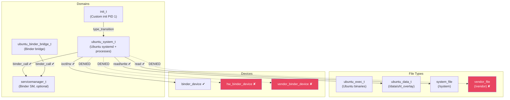

# SELinux Policy Outline — Ubuntu GSI

This document describes the target SELinux CIL policy for the Ubuntu GSI.
The policy file (`ubuntu_gsi.cil`) is currently in development.

> **Note:** Ubuntu runs directly via `switch_root` (no LXC). The SELinux domains described here govern Ubuntu processes after the pivot.

---

## Policy Architecture



---

## Type Definitions

| Type | Purpose | Assigned To |
|------|---------|-------------|
| `ubuntu_system_t` | Domain for Ubuntu systemd and all spawn processes | Any process after `switch_root` |
| `ubuntu_binder_bridge_t` | Sub-domain for the binder bridge daemon | `binder-bridge` binary |
| `ubuntu_exec_t` | File type for Ubuntu binaries in the rootfs | Executables in SquashFS |
| `ubuntu_data_t` | File type for userdata overlay | `/data/uhl_overlay/**` |

---

## Rule Categories

### HwBinder Access (Allow)

| Source | Target | Permission | Rationale |
|--------|--------|-----------|-----------|
| `ubuntu_container_t` | `hwbinder_device` | `chr_file: ioctl open read write` | Required to use `/dev/hwbinder` |
| `ubuntu_container_t` | `hwservicemanager` | `hwbinder: call transfer` | Register/lookup HIDL services |
| `ubuntu_container_t` | `hal_power_hwservice` | `hwbinder: call transfer` | Access HIDL power HAL (lazy) |
| `ubuntu_container_t` | `hal_sensors_hwservice` | `hwbinder: call transfer` | Access HIDL sensors (lazy) |
| `ubuntu_container_t` | `hal_wifi_hwservice` | `hwbinder: call transfer` | HIDL WiFi management (lazy) |
| `ubuntu_container_t` | `hal_bluetooth_hwservice` | `hwbinder: call transfer` | HIDL Bluetooth (lazy) |
| `ubuntu_container_t` | `hal_audio_hwservice` | `hwbinder: call transfer` | HIDL Audio (lazy) |
| `ubuntu_container_t` | `hal_camera_hwservice` | `hwbinder: call transfer` | HIDL Camera Provider (lazy) |
| `ubuntu_container_t` | `hal_graphics_composer_hwservice` | `hwbinder: call transfer` | HIDL Composer (lazy) |
| `ubuntu_container_t` | `hal_telephony_hwservice` | `hwbinder: call transfer` | HIDL Radio HAL (lazy) |
| `ubuntu_container_t` | `hal_gnss_hwservice` | `hwbinder: call transfer` | HIDL GNSS (lazy) |
| `ubuntu_container_t` | `hal_vibrator_hwservice` | `hwbinder: call transfer` | HIDL Vibrator (lazy) |
| `ubuntu_container_t` | `hal_fingerprint_hwservice` | `hwbinder: call transfer` | HIDL Fingerprint (lazy) |
| `ubuntu_container_t` | `hal_face_hwservice` | `hwbinder: call transfer` | HIDL Face (lazy) |

> [!NOTE]
> All HAL services are **lazy and optional**. The container gracefully handles their absence — if a HAL isn't registered, the binder lookup simply returns `nullptr`.

### Binder Access (Deny — neverallow)

| Source | Target | Denied Permission | Rationale |
|--------|--------|------------------|-----------|
| `ubuntu_container_t` | `hwservice_manager_type` | `binder: call transfer` | **No HIDL** — blocks all hwbinder transactions |
| `ubuntu_container_t` | `hwservicemanager` | `binder: call transfer` | Hwservice manager not started, access also denied |
| `ubuntu_container_t` | `vendor_binder_device` | `chr_file: *` | No vendor binder domain |
| `ubuntu_container_t` | `hw_binder_device` | `chr_file: *` | No hwbinder device access |

### Filesystem Access

| Source | Target | Permission | Direction |
|--------|--------|-----------|-----------|
| `ubuntu_container_t` | `ubuntu_container_data_t` | `dir/file/lnk_file: full` | ✔ Allow |
| `ubuntu_container_t` | `system_file` | `dir/file: read` | ✔ Allow (read-only) |
| `ubuntu_container_t` | `vendor_file` | `dir/file: *` | ✘ **neverallow** |
| `ubuntu_container_t` | `odm_file` | `dir/file: *` | ✘ **neverallow** |
| `ubuntu_container_t` | `product_file` | `dir/file: *` | ✘ **neverallow** |
| `ubuntu_container_t` | `vendor_file` | `file: execute` | ✘ **neverallow** (no vendor lib linking) |

### Capability Rules

| Capability | Status | Rationale |
|-----------|--------|-----------|
| `chown`, `dac_override`, `fowner`, `fsetid` | ✔ Allow | Basic filesystem operations |
| `kill`, `setgid`, `setuid`, `setpcap` | ✔ Allow | Process management |
| `net_bind_service`, `net_admin` | ✔ Allow | Network binding and config |
| `sys_chroot`, `sys_nice`, `sys_resource` | ✔ Allow | Container operation |
| `audit_write`, `setfcap`, `ipc_lock`, `ipc_owner` | ✔ Allow | IPC and audit |
| `sys_admin` | ✘ **neverallow** | Blocks mount manipulation, namespace operations |
| `sys_module` | ✘ **neverallow** | Blocks kernel module loading |
| `sys_rawio` | ✘ **neverallow** | Blocks raw I/O port access |
| `net_raw` | ✘ **neverallow** | Blocks raw sockets |
| `sys_boot` | ✘ **neverallow** | Blocks reboot |
| `sys_ptrace` | ✘ **neverallow** | Blocks cross-process debugging |
| `mknod` | ✘ **neverallow** | Blocks device node creation |

### Network Rules

| Source | Socket Type | Status | Rationale |
|--------|------------|--------|-----------|
| `ubuntu_container_t` | `tcp_socket` | ✔ Allow | Standard networking |
| `ubuntu_container_t` | `udp_socket` | ✔ Allow | DNS, NTP, etc. |
| `ubuntu_container_t` | `unix_stream_socket` | ✔ Allow | Local IPC (dbus) |
| `ubuntu_container_t` | `unix_dgram_socket` | ✔ Allow | Logging, systemd |
| `ubuntu_container_t` | `rawip_socket` | ✘ **neverallow** | No raw IP |
| `ubuntu_container_t` | `packet_socket` | ✘ **neverallow** | No packet capture |

---

## Policy Compilation

The CIL policy must be compiled and merged with the base Android platform policy:

```bash
# Compile CIL to binary policy
secilc /system/etc/selinux/ubuntu_gsi.cil \
    -o /system/etc/selinux/ubuntu_gsi_policy.bin \
    -M 1

# Or integrated into the AOSP build system:
# BOARD_SEPOLICY_DIRS += system/etc/selinux
```

> [!IMPORTANT]
> The CIL policy references type names (`servicemanager`, `vendor_file`, `hal_*_service`, etc.) that must exist in the base platform policy. When integrating with a specific AOSP build, verify type name compatibility.
