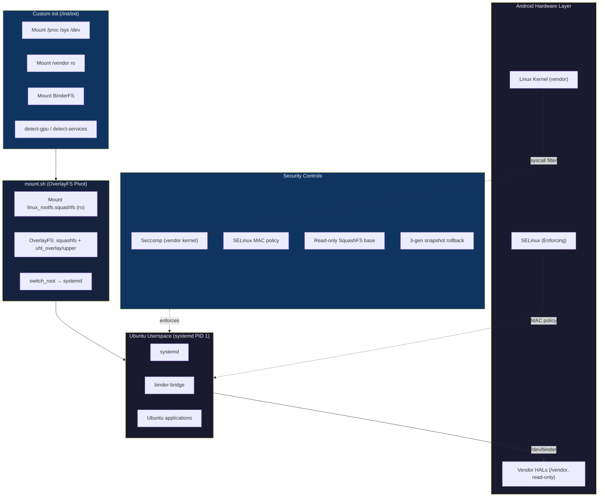
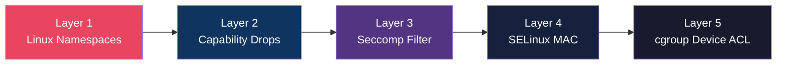

# Security Threat Model — Ubuntu GSI

This document analyzes attack surfaces, threat scenarios, and mitigations for Ubuntu running directly on Android hardware via the custom init + OverlayFS pivot architecture.

---

## Architecture Overview

---

## Trust Boundaries

| Boundary | Description | Protection |
|----------|-------------|------------|
| **Ubuntu ↔ Kernel** | Syscall interface | SELinux MAC, seccomp (vendor kernel) |
| **Ubuntu ↔ Binder** | IPC via `/dev/binder` | SELinux `binder_call` rules |
| **Ubuntu ↔ /vendor** | Read-only bind mount | Mounted `ro`; writes blocked at VFS level |
| **Ubuntu ↔ userdata** | OverlayFS upper layer | `nosuid,nodev` mount options |
| **Ubuntu ↔ system** | system.img at `/` (squashfs lower) | Read-only SquashFS; immutable |

---

## Attack Surfaces & Mitigations

### 1. Binder IPC

| Threat | Risk | Mitigation | Residual Risk |
|--------|------|------------|---------------|
| Unauthorized binder transactions to vendor services | **High** | SELinux `neverallow` for hwbinder/vendor binder domains | Low — compile-time policy enforcement |
| Binder transaction smuggling (malformed parcels) | **Medium** | Kernel binder driver validates parcels; SELinux restricts target services | Low |
| DoS via binder thread exhaustion | **Medium** | `BINDER_SET_MAX_THREADS` limited; cgroup PID limit (4096) | Low |
| Binder use-after-free (kernel CVE) | **High** | Kernel patching responsibility on vendor; seccomp blocks exploit primitives | Medium — depends on vendor kernel updates |
| Accessing non-HIDL services | **Medium** | SELinux `hwbinder_call` allow-list only permits known HIDL HAL types | Low |

### 2. Privilege Escalation

> Ubuntu runs as a direct systemd session after `switch_root` with no container namespace isolation. Privilege escalation mitigations rely on SELinux and the vendor kernel's seccomp support.

### 3. Filesystem

| Threat | Risk | Mitigation | Residual Risk |
|--------|------|------------|---------------|
| Modifying system partition | **High** | Mounted read-only; dm-verity on boot partition | Very Low |
| Accessing vendor blobs | **High** | `/vendor` never mounted in container; SELinux `neverallow` | Very Low |
| Symlink attacks on OverlayFS | **Medium** | Container runs with restricted capabilities; `nosuid,nodev` mount options | Low |
| Data exfiltration from host `/data` | **Medium** | Only `/data/ubuntu/` subtree visible; mount namespace isolation | Low |
| OverlayFS privilege escalation | **Low** | Upper layer on `/data` with `nosuid,nodev`; no `CAP_SYS_ADMIN` | Very Low |

### 4. Network

| Threat | Risk | Mitigation | Residual Risk |
|--------|------|------------|---------------|
| Raw socket abuse (ARP spoofing, etc.) | **Medium** | `CAP_NET_RAW` dropped; `rawip_socket` denied by SELinux | Very Low |
| Network scanning from container | **Low** | `CAP_NET_RAW` dropped; standard TCP/UDP still allowed | Low — acceptable for Ubuntu functionality |
| Host network namespace escape | **Medium** | Full network namespace isolation (veth pair) | Very Low |
| DNS poisoning | **Low** | systemd-resolved with DNSSEC support available | Low |

### 5. Kernel

| Threat | Risk | Mitigation | Residual Risk |
|--------|------|------------|---------------|
| Kernel exploit via privileged syscalls | **Critical** | Seccomp denies `kexec_load`, `bpf`, `perf_event_open`, `add_key`, etc. | Medium — zero-day kernel vulns |
| Side-channel attacks (Spectre, etc.) | **Medium** | `userfaultfd` denied by seccomp | Medium — hardware-level mitigations needed |
| Clock manipulation | **Low** | seccomp denies `clock_settime`, `settimeofday`, `adjtimex` | Very Low |
| Swap manipulation | **Low** | seccomp denies `swapon`/`swapoff` | Very Low |

---

## Defense-in-Depth Summary

The security architecture uses **5 independent layers**, each of which must be bypassed for a successful attack:

| Layer | What it blocks | Bypass difficulty |
|-------|---------------|-------------------|
| **Namespaces** | Process/mount/network/IPC visibility | Requires kernel exploit |
| **Capability drops** | Privileged operations (module loading, raw I/O) | Requires capability assignment bug |
| **Seccomp** | Dangerous syscalls entirely | Requires seccomp bypass (very rare) |
| **SELinux** | Unauthorized file/binder/device access | Requires policy bypass or disable |
| **cgroup device ACL** | Hardware device access | Requires cgroup escape |

---

## Specific Scenario Analysis

### Scenario A: Malicious Ubuntu Package

**Attack**: A compromised apt package runs as root inside the container and attempts to escalate to host.

| Step | Attacker Action | Defense |
|------|----------------|---------|
| 1 | Package runs post-install script as container root | Container root ≠ host root (capability-restricted) |
| 2 | Attempts `insmod malicious.ko` | seccomp DENY + `CAP_SYS_MODULE` dropped |
| 3 | Attempts to write to `/proc/sys/kernel` | SELinux DENY + `/proc` mounted mixed |
| 4 | Attempts `mknod /dev/sda` | seccomp DENY + `CAP_MKNOD` dropped + cgroup device deny |
| 5 | Attempts to access `/vendor` | Not mounted, SELinux `neverallow` |
| **Result** | ❌ Attack contained within container | All layers hold |

### Scenario B: Binder Service Impersonation

**Attack**: Container process attempts to register a fake system service via binder.

| Step | Attacker Action | Defense |
|------|----------------|---------|
| 1 | Process opens `/dev/hwbinder` | Allowed (needed for legitimate HIDL access) |
| 2 | Attempts `addService("SurfaceFlinger", ...)` | SELinux denies — `ubuntu_container_t` not allowed to register system services |
| 3 | Attempts `addService("activity", ...)` | SELinux denies — not in allowed HAL service list |
| **Result** | ❌ Service registration blocked | SELinux binder_call rules hold |

### Scenario C: Container Escape via Kernel Vulnerability

**Attack**: Exploit a kernel CVE to escape container isolation.

| Step | Attacker Action | Defense |
|------|----------------|---------|
| 1 | Attempts to use exploit primitive (e.g., `userfaultfd`) | seccomp DENY |
| 2 | Attempts `bpf()` for kernel memory manipulation | seccomp DENY |
| 3 | Attempts `perf_event_open` for info leak | seccomp DENY |
| 4 | Attempts `ptrace` on host process | seccomp DENY + namespace isolation |
| 5 | Finds a novel syscall-based exploit | SELinux MAC still enforced even post-exploit |
| **Result** | ⚠️ Depends on exploit | Multiple layers reduce exploitability significantly |

---

## Risk Matrix Summary

| Category | Threats Addressed | Overall Risk After Mitigation |
|----------|-------------------|------------------------------|
| Container Escape | 8 | 🟢 **Low** |
| Binder Abuse | 5 | 🟢 **Low** |
| Filesystem Tampering | 5 | 🟢 **Low** |
| Network Abuse | 4 | 🟢 **Low** |
| Kernel Exploitation | 4 | 🟡 **Medium** (vendor kernel dependency) |

---

## Recommendations

1. **Kernel updates**: The vendor kernel is the largest residual risk. Recommend using devices with monthly security patches.
2. **User namespaces**: Consider enabling unprivileged user namespaces in the LXC container for additional UID mapping isolation.
3. **Audit logging**: Enable SELinux `auditd` or `logd` collection of AVC denials for runtime monitoring.
4. **AppArmor stacking**: On kernels supporting LSM stacking, consider adding AppArmor profiles inside the container alongside host SELinux.
5. **binderfs per-namespace**: If the kernel supports it, use binderfs in a per-IPC-namespace mode for complete binder isolation.
